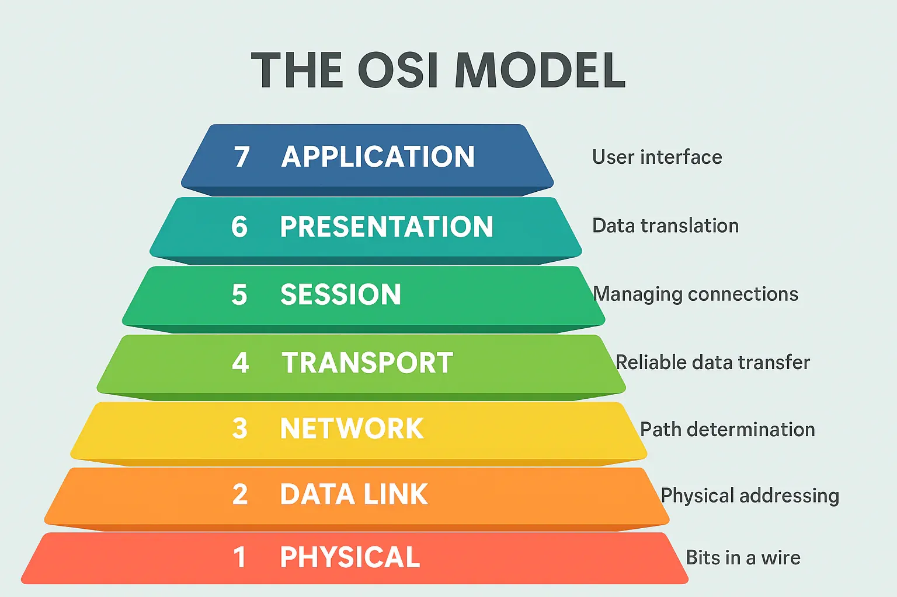
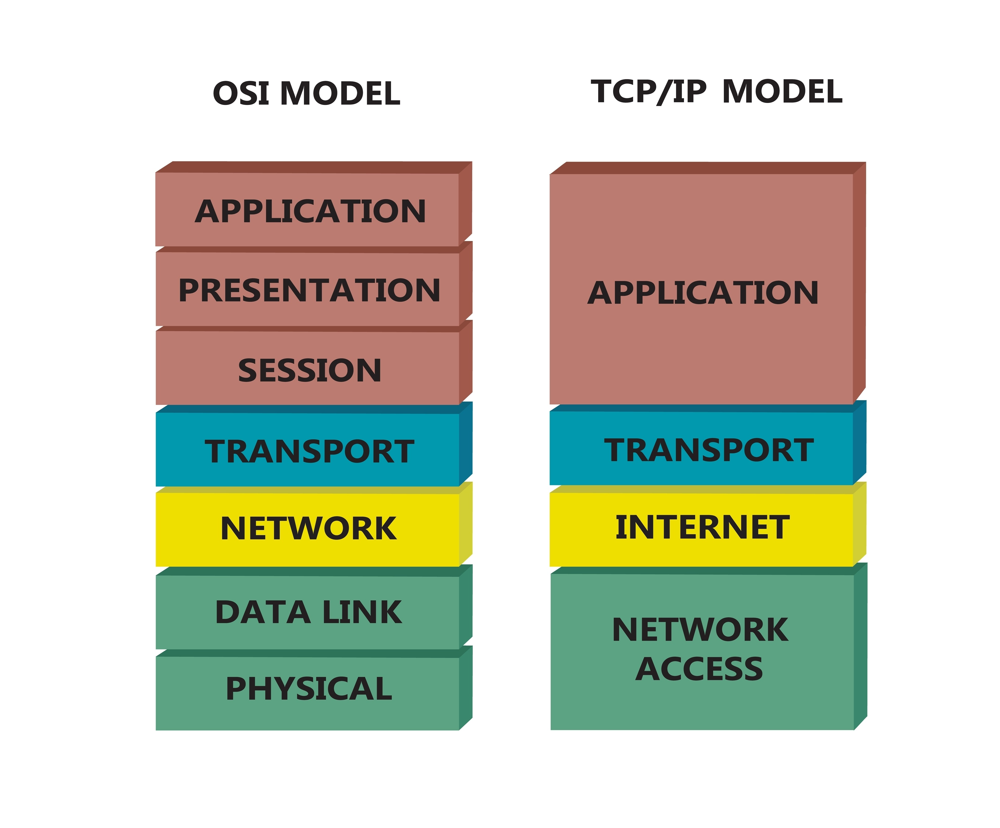

## **🌐 OSI 7계층과 TCP/IP 4계층**

첫 주 스터디 주제로 네트워크를 다루기로 했는데, DNS나 HTTP처럼 바로 떠오르는 실생활 프로토콜에 비해 OSI 7계층과 TCP/IP 모델은 개념적이라 어떻게 풀어야 할지 막막했어요. 그래서 이번 기회에 차근차근 알아보면 이해에 큰 도움이 될 것 같아서 해당 주제로 정리해보려고 해요.

### **🌐 OSI가 무엇인지, 왜 등장했는지부터 정리해볼게요.**

네트워크라는 개념이 처음 발전하던 시기에는 서로 다른 회사, 다른 시스템, 다른 기술들이 각자 제멋대로 통신 방식을 만들었어요. 그래서 시스템 간 연결이 어렵고, 확장성도 낮고, 표준이 없어 호환성 문제가 계속 생겼어요. 이런 혼란을 해결하기 위해 `국제 표준화 기구(ISO)`가 `누구나 이해하고 공통으로 사용할 수 있는 통신 모델`을 만들어 발표했어요. 그 모델이 바로 우리가 흔히 말하는 OSI(Open Systems Interconnection) 모델, 즉 OSI 7계층 모델이에요.

이 모델은 실제 기술이나 구현체라기보다 네트워크를 구조적으로 설명하기 위한 `개념적 모델`에 더 가까워요. 그래서 네트워크를 공부할 때 가장 많이 등장하는 기준점이 되었어요.

### **OSI 7계층 모델**

OSI 모델은 네트워크 통신 과정을 일곱 단계로 나누어 설명해요. 각각의 계층은 자신의 역할이 명확하게 분리되어 있고, 하위 계층에 서비스 요청, 상위 계층에 서비스 제공이라는 방식으로 서로 협력해요. 이렇게 계층을 나누면 복잡한 네트워크 구조를 훨씬 명확하게 이해할 수 있어요.

- **OSI 7계층**

| 계층      | 이름                    | 주요 역할 / 데이터 단위                                     |
| --------- | ----------------------- | ----------------------------------------------------------- |
| **7계층** | 응용 (Application)      | 사용자와 가장 가까운 계층, HTTP·DNS·SMTP 같은 프로토콜 동작 |
| **6계층** | 표현 (Presentation)     | 데이터 형식 변환, 암호화/복호화, 압축                       |
| **5계층** | 세션 (Session)          | 세션 연결, 유지, 종료 관리                                  |
| **4계층** | 전송 (Transport)        | 종단 간 데이터 전송, 오류 제어, 흐름 제어 (Segment)         |
| **3계층** | 네트워크 (Network)      | IP 주소 기반 라우팅, 경로 결정 (Packet)                     |
| **2계층** | 데이터 링크 (Data Link) | 물리적 링크에서 프레임 단위 전송, MAC 주소 사용 (Frame)     |
| **1계층** | 물리 (Physical)         | 전기 신호·비트 단위 전송, 케이블·장비 (Bit)                 |

계층 순서는 아래에서 위로 `물리 → 데이터 링크 → 네트워크 → 전송 → 세션 → 표현 → 응용` 이렇게 올라가요.

---

### **OSI 7계층, 실제 통신 흐름으로 이해해볼게요.**

처음은 OSI 7계층이 어떤 구조로 이루어져 있는지 전체적으로 훑어봤어요. 이번에는 위 이미지처럼, 데이터가 실제로 어떻게 각 계층을 지나서 목적지까지 도착하는지 흐름 중심으로 설명해볼게요.

이미지는 A 사용자 PC에서 보낸 데이터가 여러 계층을 거쳐 B 사용자 PC까지 전달되는 과정을 잘 나타내고 있어요.

**1) A 사용자 PC**

**: 데이터가 위에서 아래로 내려가요**

사용자가 어떤 요청을 보내면(ex. 웹페이지 요청), 이 데이터는 A PC의 7계층을 `위 → 아래`로 순서대로 내려가요.

- 7계층(응용)에서 데이터를 생성하고
- 6, 5계층을 지나면서 표현·세션 정보가 붙고
- 4계층(전송)에서는 TCP/UDP 헤더가 붙고
- 3계층(네트워크)에서는 IP 헤더가 붙고
- 2계층(데이터 링크)에서는 MAC 주소가 붙고
- 1계층(물리)에서는 비트 단위 신호로 변환돼요.

즉, 계층을 내려갈수록 데이터에 새로운 헤더가 계속 앞에 붙는 구조예요.

그래서 이미지처럼 왼쪽으로 갈수록 데이터 단위가 점점 통통해지는 모습을 볼 수 있어요.

이 과정을 `캡슐화(Encapsulation)`라고 해요.

**2) 중간 노드(라우터)**

**:필요한 계층까지만 처리해요**

이미지의 가운데 부분은 라우터처럼 중간에서 경로를 안내하는 네트워크 장비를 표현하고 있어요.

라우터는 A와 B처럼 전체 7계층을 모두 다루지 않아요.

라우터의 역할은 3계층(네트워크 계층)에서 데이터를 보고 어느 경로로 보낼지 결정하는 것이라서 3계층까지만 처리해요.

그래서 가운데 박스에 보면:

- `물리 계층 → 데이터 링크 계층 → 네트워크 계층`까지만 존재해요.
- 응용, 표현, 세션, 전송 계층은 아예 없어요.

즉, 라우터는 데이터 내용을 보지 않고 IP 주소 기반으로 어디로 보내야 하는지 경로만 판단하는 장비예요.

**3) B 사용자 PC**

**: 데이터가 아래에서 위로 올라가요**

라우터를 거쳐 B 사용자 PC에 도착한 데이터는 이제 반대로 1 계층 → 7 계층으로 올라가요.

이 과정은 `역캡슐화(Decapsulation)`라고 하고, A에서 내려갈 때 붙었던 헤더들을 각 계층에서 하나씩 벗겨가며 원래 데이터가 복원돼요. 그래서 이미지 오른쪽을 보면 계층을 올라갈수록 데이터가 점점 얇아지는 형태로 표현되어 있어요.

최종적으로 7계층 응용 계층에 도착하면 사용자가 이해할 수 있는 형태로 데이터가 완성되고, 브라우저나 앱에 표시돼요.

**정리해보면,**

이미지가 보여주는 핵심은 이거예요:

1. A에서 데이터 생성 → 아래 계층으로 내려가며 헤더가 붙음(캡슐화)
2. 중간 라우터는 3계층까지만 확인하고 경로만 결정
3. B에서 위 계층으로 올라가며 헤더를 벗김(디캡슐화)
4. 최종적으로 사용자에게 의미 있는 데이터가 도착함

⇒ 즉, 데이터가 네트워크를 통해 이동할 때 정확히 어떤 단계를 거치는지 보여주는 구조도예요.

---

### **핵심 계층 딥다이브: 네트워크 계층과 전송계층**

네트워크 통신의 핵심 기능이 구현되고, 실제 프로토콜들이 동작하는 **네트워크 계층**과 **전송 계층**을 중심으로 자세히 살펴볼게요.

### **네트워크 계층**

네트워크 계층은 간단히 말하면 패킷이 목적지까지 갈 수 있는 길을 찾아주는 계층이에요. 그래서 핵심 프로토콜이 바로 IP(Internet Protocol)예요.

이 계층은 데이터를 ‘패킷’이라는 단위로 쪼갠 뒤, 여기에 출발지와 목적지의 IP 주소를 붙여요. 그리고 이 패킷이 여러 네트워크 장비들을 지나 목적지까지 도달할 수 있도록 경로를 선택해요. 이 과정이 바로 라우팅이에요.

라우터가 패킷을 다음 라우터로 넘기고, 그 다음 라우터가 또 넘기고 ,, 이런 식으로 패킷은 최종 목적지를 향해 한 단계씩 이동하고 네트워크 장비들은 각자 자신이 가진 라우팅 테이블을 보고 다음 목적지로 어디로 보내야 할지를 판단해요.

여기서 중요한 건, IP는 비연결성이라는 점이에요. 패킷을 목적지까지 보내기만 하고, 도착했는지 확인하지 않아요. 그래서 패킷이 중간에 사라질 수도 있고, 순서가 뒤바뀔 수도 있어요. 이 계층은 기본적인 주소와 경로만 책임질 뿐, 신뢰성 있는 전송은 상위 계층에게 맡기는 구조예요. 이 덕분에 인터넷은 단순하고 확장성 높게 설계되어 있어요.

### **전송 계층**

네트워크 계층이 주소를 보고 택배를 배달하는 택배 기사 같은 역할이라면, 전송 계층은 택배가 주문한 사람에게 정확히 잘 도착하도록 관리하는 관리자에 가까워요. 즉, 실제로 서버와 클라이언트 간에 데이터를 주고받을 때 필요한 관리 기능이 여기 해당해요.

이 계층에서 가장 중요한 두 가지 프로토콜이 바로 TCP와 UDP예요.

- **TCP**

  TCP는 우리가 웹 개발하면서 가장 자주 만나는 방식이에요. HTTP, HTTPS, 파일 다운로드, 이메일 전송 등 대부분의 중요한 통신은 TCP 위에서 돌아가요.

  먼저 TCP는 **연결 지향적**이에요. 데이터를 보내기 전에 3-Way Handshake라는 과정을 통해 서로 준비 여부를 확인하고 논리적 연결을 맺어요. 그리고 나서 데이터를 전송하기 시작해요.

  전송 도중에도 여러 작업을 해요.

  - 데이터가 분실되지 않았는지 확인하고
  - 순서가 뒤바뀌면 다시 정렬하고
  - 누락된 패킷이 있으면 재전송하고
  - 너무 빨리 데이터를 보내면 상대가 못 받을 수 있으니 속도도 조절하고
  - 네트워크가 혼잡하면 스스로 전송량도 줄여요

  이런 기능들 덕분에 TCP는 정확성과 안정성을 우선으로 하는 통신 방식이에요. 그래서 웹 브라우저에서 페이지를 열거나 API를 호출할 때 항상 TCP를 사용하는 거예요.

- **UDP**

  반대로 UDP는 TCP와 거의 반대되는 성격을 가지고 있어요.

  연결을 맺지 않고, 데이터가 제대로 갔는지 확인하지도 않아요. 그렇기 때문에 훨씬 빠르고 가벼워요.

  덕분에 약간의 데이터 손실이 있어도 괜찮은 서비스, 예를 들면 스트리밍, 음성 통화, 온라인 게임, DNS 요청 같은 분야에서 많이 사용돼요. 실시간성이 중요한 서비스에서는 조금 깨져도 상관없으니 빠르게 보내는 것이 중요하거든요.

---

### **🌐 TCP/IP**

TCP/IP 모델은 인터넷이라는 실제 환경 속에서 사용되는 프로토콜들의 구조를 정리해 놓은 모델이에요. OSI가 계층을 나누는 개념적 제안이었다면, TCP/IP는 실제로 인터넷을 구성하던 프로토콜들을 나중에 묶어서 체계화한 실용 모델이라는 점이 달라요.

그래서 TCP/IP는 OSI보다 훨씬 단순하고, 실제 네트워크 동작 흐름과 더 딱 맞아떨어지고 OSI처럼 7계층으로 나누지 않고, 관련된 성격을 묶어서 4계층으로 정리했어요.

### **TCP/IP 4계층 구조**

TCP/IP 모델은 OSI 상위의 `응용·표현·세션 계층`을 하나로 합쳐서 응용 계층으로 관리하고, OSI 하위의 ‘데이터링크·물리 계층’을 묶어 `네트워크 인터페이스 계층`으로 정리해요.

실제로 우리가 사용하는 HTTP, HTTPS, FTP, SSH 같은 프로토콜들도 모두 이 모델의 응용 계층에서 동작해요.

| 계층      | 이름                                         | 주요 역할 / 데이터 단위                                         |
| --------- | -------------------------------------------- | --------------------------------------------------------------- |
| **4계층** | 응용 계층 (Application)                      | 웹, 이메일, DNS 등 애플리케이션에서 사용하는 모든 프로토콜 제공 |
| **3계층** | 전송 계층 (Transport)                        | TCP/UDP 기반 종단 간 통신, 포트 번호 사용, 오류·흐름 제어       |
| **2계층** | 인터넷 계층 (Internet)                       | IP 기반 라우팅, 목적지까지 패킷 전달 (Packet)                   |
| **1계층** | 네트워크 인터페이스 계층 (Network Interface) | 실제 네트워크 매체와 연결, 프레임 전송 (Frame)                  |

결국 우리가 웹 페이지를 열거나 API 요청을 보내고, 메시지를 주고받는 모든 과정은 눈에 보이지 않는 네트워크 계층들의 움직임으로 이루어져 있어요.

현재 인터넷에서 이루어지는 대부분의 통신은 TCP/IP 모델을 기반으로 동작하고, 우리가 익숙하게 사용하는 HTTP, HTTPS, DNS 같은 프로토콜들도 모두 TCP/IP 위에서 작동하고 있어요. 하지만, 네트워크를 더 깊이 이해하고 구조적으로 바라보려면 OSI라는 개념적 틀이 큰 도움이 돼요. OSI 모델과 TCP/IP 모델을 함께 살펴보면, 각 계층이 어떤 역할을 하는지 이해할 수 있고, 전체 흐름을 훨씬 명확하게 파악할 수 있어요.

현실에서는 TCP/IP가 실제 기반이 되고, 개념적으로는 OSI 모델이 기준이 되기 때문에, 두 모델을 함께 이해하면 문제를 계층별로 나누어 분석할 수 있고 우리가 매일 사용하는 인터넷 기술들이 어떤 원리로 동작하는지도 자연스럽게 이해할 수 있게 돼요. 그래서 개발자나 네트워크를 다루는 사람이라면 TCP/IP와 OSI 모델을 함께 살펴보는 것이 인터넷의 구조와 동작 원리를 이해하는데 도움이 된다 생각해요.
